# E-Commerce real time project
1.RsCart
======
RsCart is a very simple and clean-design blog system implemented with Spring F/W.
It's one of my learning projects to explore awesome features in Spring java Config web programming.
## Development
Its a E-Commerce Shopping Application built for Customer operations. Application is built using Spring framework and Data base handling is managed using Spring JDBC.
Following are the operations that can be performed by the Respective User
# Registering into System:
 - Login into Website
 - Updating Address
 - Adding product to Cart
 - Updating/ Deleting the Product
 - Placing the order 
# Technologies:
 - Maven Project
 - Apache Tomcat Server
 - Spring Java Configuration
 - Spring JDBC
 - JSP, Spring Forms
 - JSTL
 - oracle
 - PMD
#Rs-tx account number:98745632198745

### 2. Renderings
##Admin
#### 2.1 home
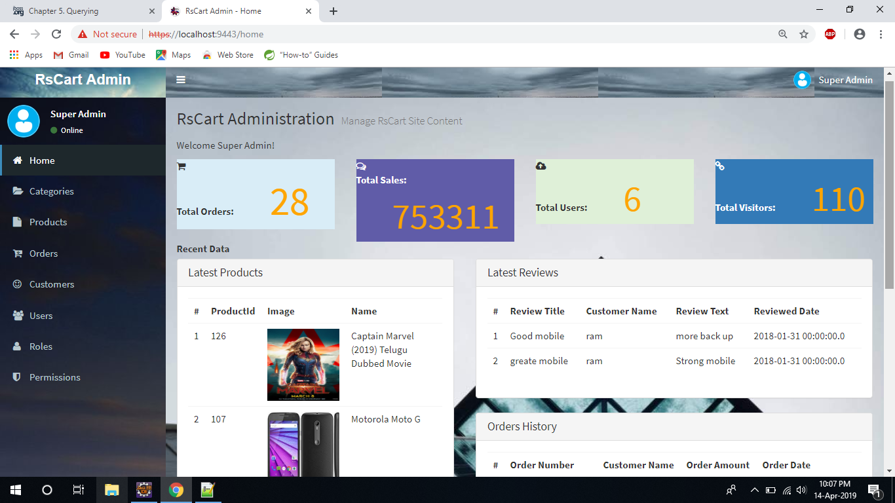

#### 2.2 Categories
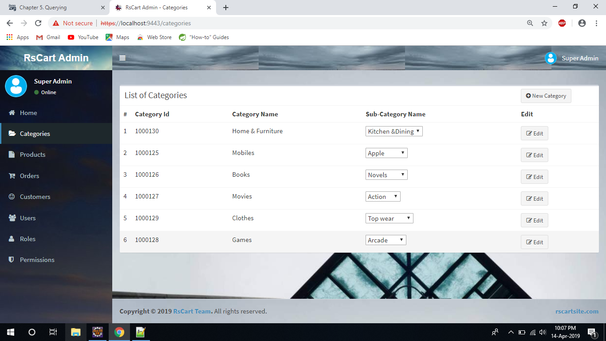

#### 2.3 products
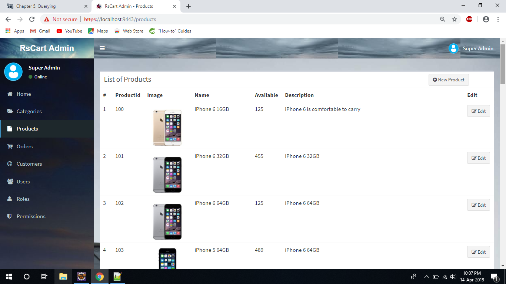

#### 2.4 ordes
![Resume] (screenshots/Admin4.png)

#### 2.5 users
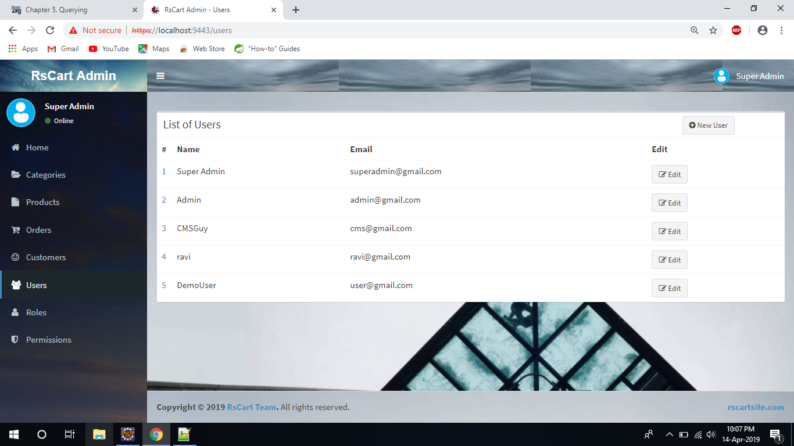

#### 2.6 roles
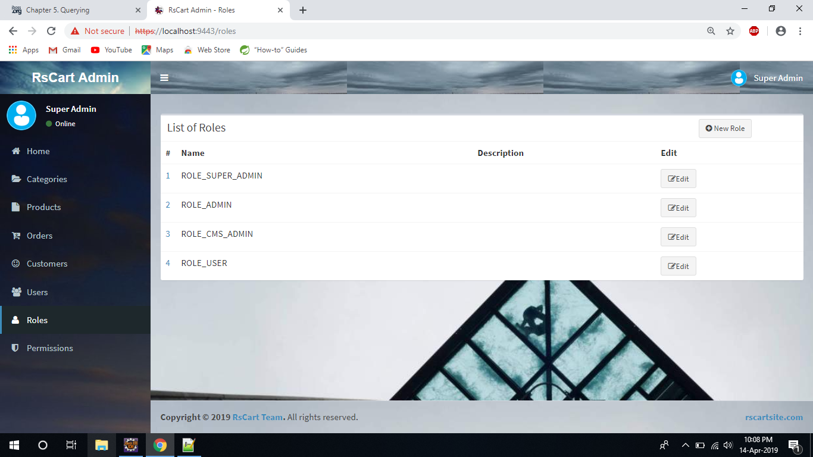

#### 2.7 permissions
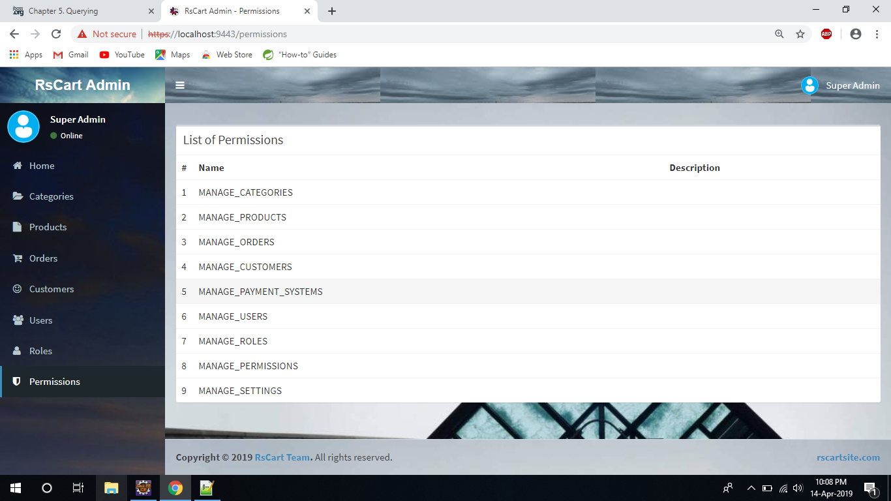

#### 2.8 edit order
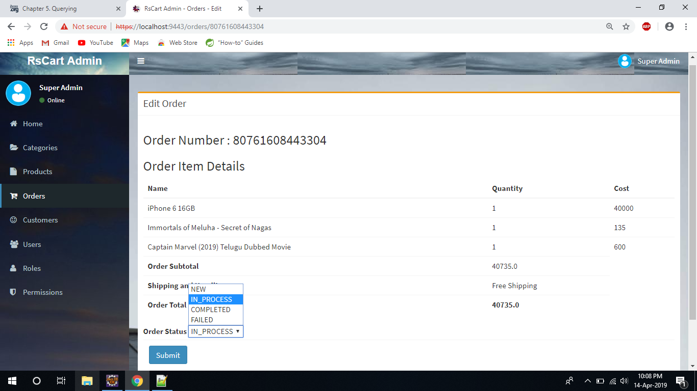
##Site

#### 2.9 Home
![Resume] (screenshots/site1.png)

#### 2.10 Footer
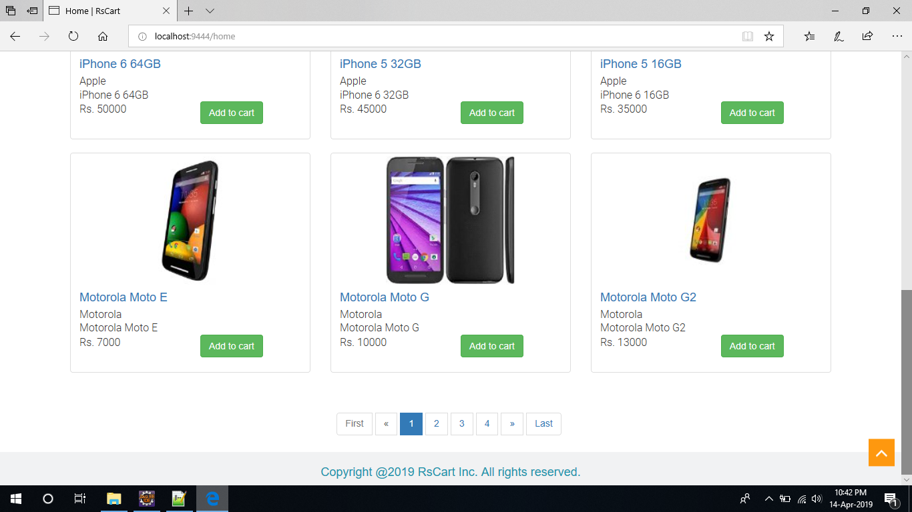

#### 2.11 pagination
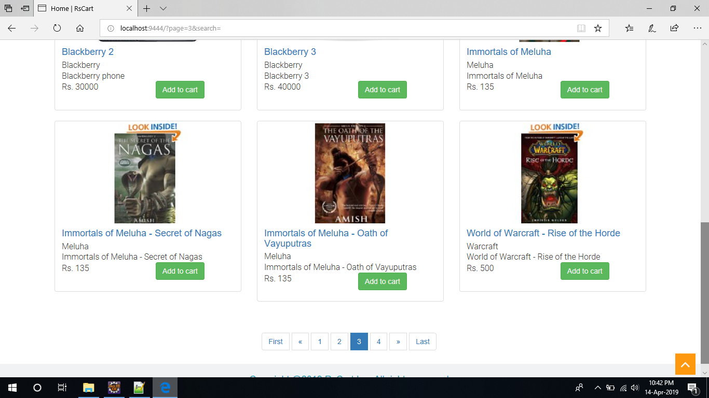

#### 2.12 head menu
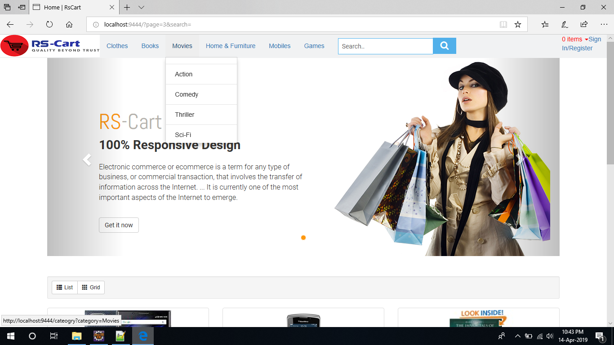

#### 2.13 search
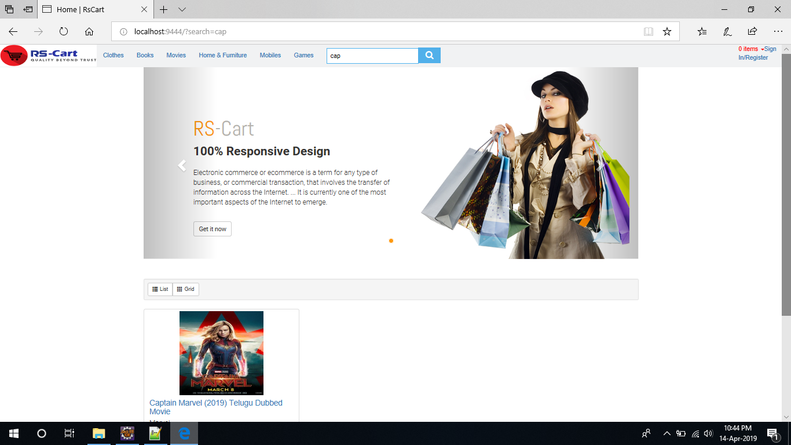

#### 2.14 cart
![Resume] (screenshots/site6.png)

#### 2.15 login
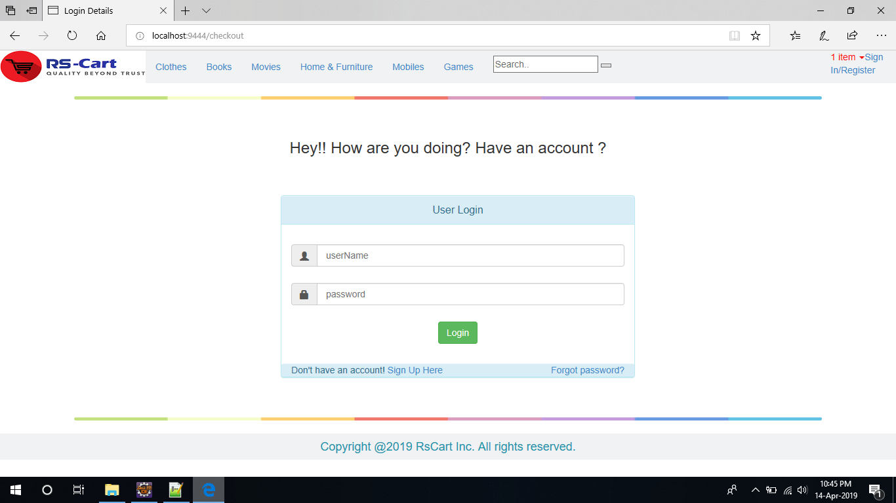

#### 2.16 user account
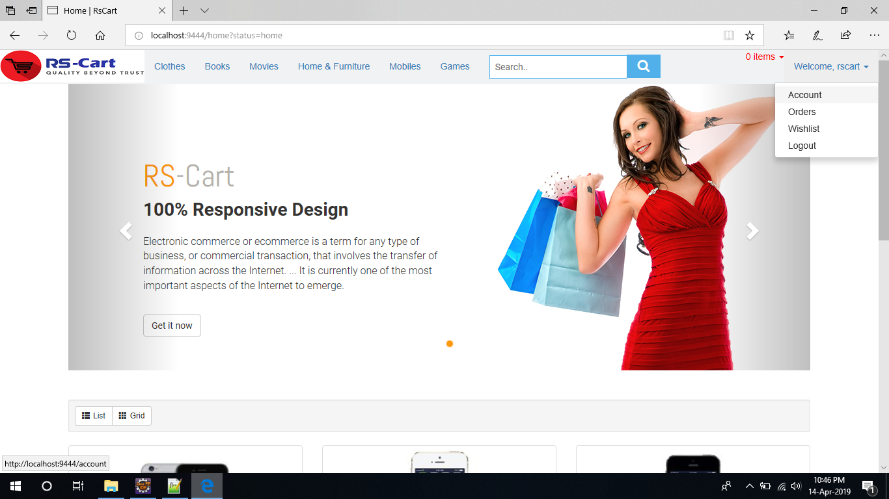

#### 2.17 account view
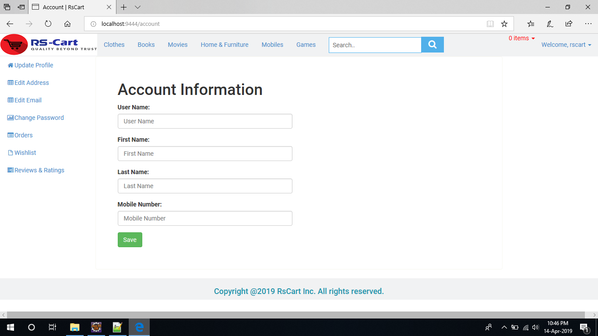

#### 2.18 order List
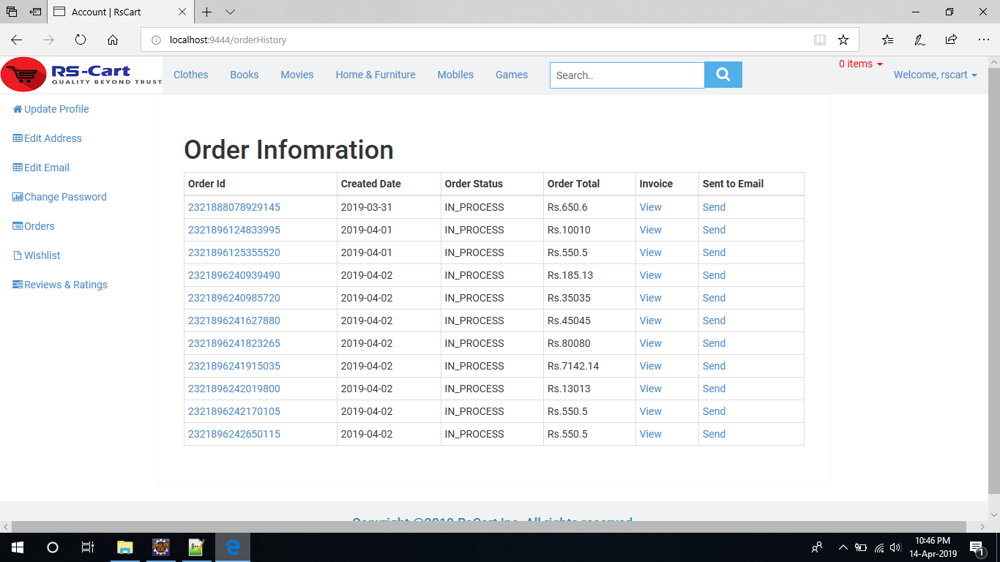

#### 2.19 invoice
![Resume] (screenshots/site11.png)

#### 2.20 coupon
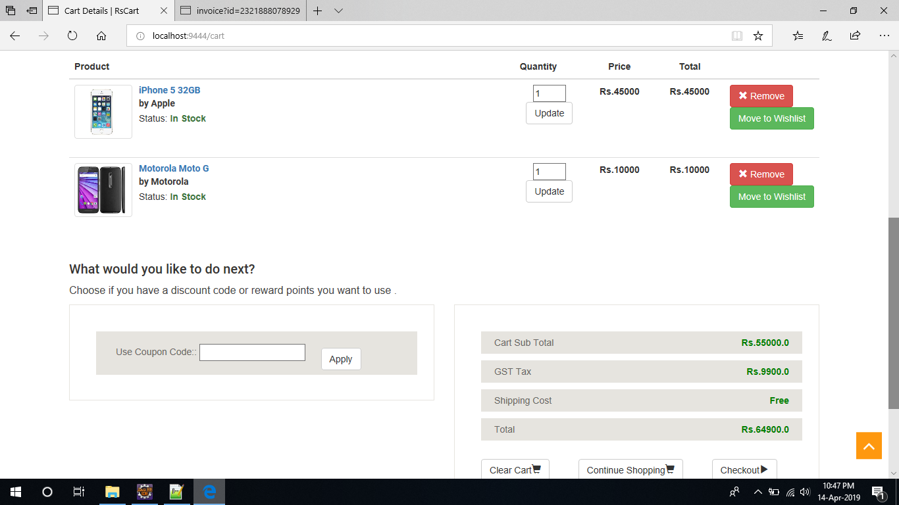

#### 2.21 checkout
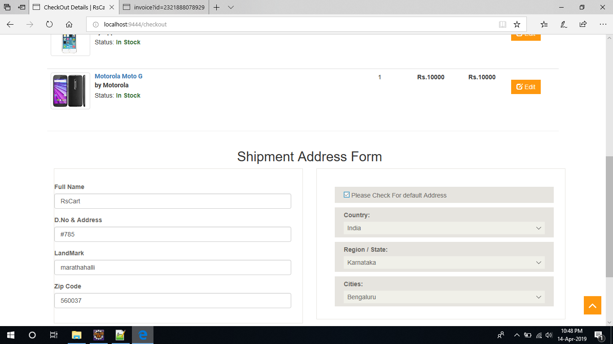

#### 2.22 payment
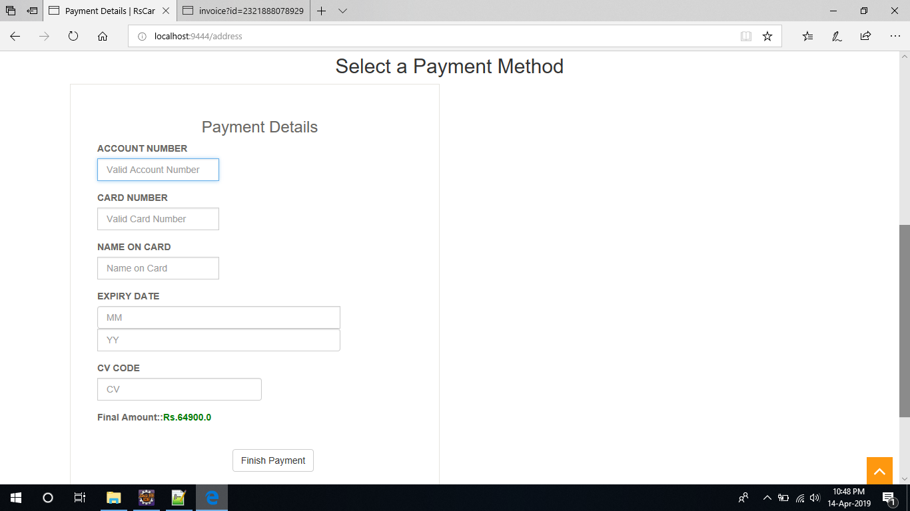